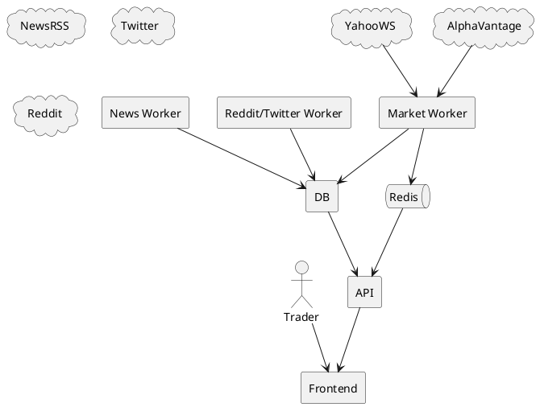

# Flux de données

Ce schéma illustre la collecte de données de marché et de sentiment, leur stockage dans Postgres et la diffusion en temps réel. Les travailleurs publient les ticks sur Redis, les routes API WebSocket les relaient ensuite vers le navigateur où les graphiques se mettent à jour instantanément.
