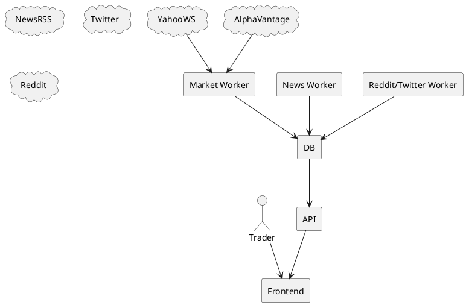

# Flux de données

```plantuml
@startuml
actor Trader
cloud YahooWS
cloud AlphaVantage
cloud NewsRSS
cloud Twitter
cloud Reddit

rectangle "Market Worker" as MW
rectangle "News Worker" as NW
rectangle "Reddit/Twitter Worker" as SW
rectangle DB
rectangle API
rectangle Frontend

YahooWS --> MW
AlphaVantage --> MW
MW --> DB
NW --> DB
SW --> DB
DB --> API
API --> Frontend
Trader --> Frontend
@enduml
```

Ce schéma illustre la collecte de données de marché et de sentiment, leur stockage dans Postgres et leur exposition via l'API puis l'interface front-end.
